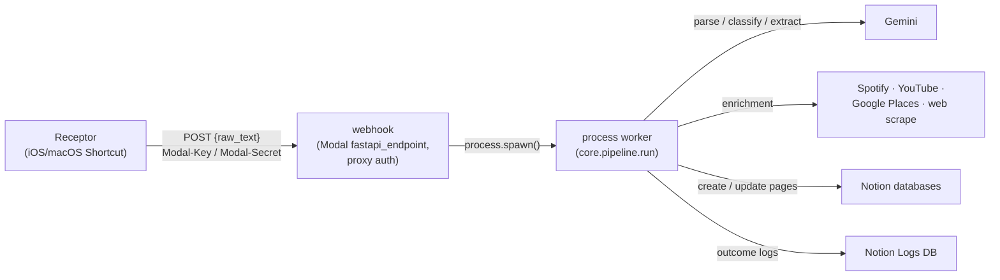

# Project Synapse 🧠

> An intelligent middleware for capturing thoughts and organizing them in Notion.

Synapse eliminates the friction of manual data entry in Notion. It accepts unstructured, natural-language text, uses a multi-step AI chain (parse → classify → extract) to understand and structure the content, and then routes it to the correct database or page in a Notion workspace. The entire project is written in **Python** and deployed on **Modal**.

---

## Architecture

- **[Modal](https://modal.com)** hosts everything. `app.py` is the single deployment shim — image, secrets, endpoints. All business logic lives in `src/core/` as plain Python with **no Modal imports**.
- **`webhook`** — a proxy-authed `fastapi_endpoint`. Callers send `Modal-Key` + `Modal-Secret` headers; unauthorized requests are rejected at Modal's edge for free. It validates the payload and `spawn()`s the worker — **spawn IS the queue** (no Pub/Sub).
- **`process`** — the background worker (`timeout=600`, `memory=512`, `max_containers=1` to serialize runs since Notion dedupe is query-then-create, retries with backoff). Runs `core.pipeline.run`.
- **Gemini** (`gemini-3-flash-preview`, env-overridable via `GEMINI_MODEL`, with automatic fallback to `GEMINI_FALLBACK_MODEL` on a 404) does parsing, classification, and extraction with structured JSON output.
- **Secrets** are env vars only: the Modal secret `synapse` in the cloud, `op run` locally. `.env.tpl` is the canonical manifest (op:// refs, committed).



## Development

```bash
uv sync              # install everything
just test            # unit tests (no network)
just check           # ruff lint + format check
just dev             # live-reload deploy against real Modal infra (modal serve)
just test-integration  # real Gemini calls (key via 1Password)
just deploy          # test + sync-secrets + modal deploy
just recept "Buy eggs $ groceries"   # send one thought to the deployed webhook
```

Local runs against real services use 1Password injection — never plaintext on disk:

```bash
op run --env-file=.env.tpl -- uv run <cmd>
```

## Manual setup steps (cannot be codified)

Everything else is code; these are one-time console/dashboard actions:

1. **Modal auth (local):** `uv run modal token new`.
2. **Modal Proxy Auth Token:** Modal dashboard → Settings → Proxy Auth Tokens → mint a token. Give the token ID/secret to Receptor (and store them on the `Modal Synapse` 1Password item). The webhook rejects requests without `Modal-Key`/`Modal-Secret` headers.
3. **Google API keys:** the old GCP project is gone, so re-mint a **Places API key** and a **YouTube Data API v3 key** in the Google Cloud console (APIs & Services → Credentials) and put them on the `Synapse Env` 1Password item.
4. **CI secret:** `gh secret set OP_SERVICE_ACCOUNT_TOKEN` with a 1Password service-account token that can read the `Personal` vault.
5. **Push secrets to Modal:** `just sync-secrets` (reads `.env.tpl`, injects via `op`, creates/updates the `synapse` Modal secret).

## Receptor client changes (v2 migration)

The [Receptor](https://github.com/alexjmiller5/receptor) app must be updated for the Modal endpoint:

- **URL:** the Modal webhook URL (shown by `modal deploy` / the Modal dashboard), not the old API Gateway URL.
- **Headers:** send `Modal-Key` and `Modal-Secret` (proxy auth token) instead of the old API key.
- **Response:** expect **200** with `{"status": "accepted", "call_id": ...}` — not 202.

## Configuration: `src/core/databases.yaml`

The whole pipeline is YAML-driven. To add a new Notion database category:

1. Add `NOTION_<CATEGORY>_DB_ID` to the `Synapse Env` 1Password item and to `.env.tpl`, then `just sync-secrets`.
2. Add the category definition to `databases.yaml`.

### Database level

| Field | Required | Usage |
| :--- | :--- | :--- |
| **`description`** | ✅ Yes | **The Classifier Prompt.** Used by the AI to decide if an incoming item belongs to this category. |
| **`helper`** | No | `true` marks a helper DB (`trips`, `logs`, `youtube-channels`) that is only *related to*, never a classification target. |
| **`properties`** | ✅ Yes | Maps **exact Notion column names** to their rules. |

### Property level

- **`type`**: `title`, `rich_text`, `rich_text_list`, `url`, `date`, `select`, `multi_select`, `status`, `relation`, `boolean`.
- **`required`**: `true` forces the AI to produce a value.
- **`instruction`**: the extraction prompt for this field. Placeholders: `{current_date}` (Eastern time), `{raw_text}`. For `date` fields the instruction MUST demand ISO 8601 — `notion_utils._notion_date` raises on anything else.
- **`virtual`**: `true` hides the field from the AI; Python fills it.
- **`allowlist`**: strict enum for select/multi_select/status (intersected with live Notion options at runtime).
- **`create_new`**: `true` lets the AI invent new values beyond the allowlist.

## Synapse Prompting Guide

- **Core Syntax**
  - **`@` splitter:** separate multiple distinct items in one message.
  - **`$` context:** define the Project, Date, Status, or category hint.
- **Defaults (if not specified)**
  - **Tasks:** Status `To Do` | Tag `Chore` | Priority `High` | Date `Today` (Eastern)
  - **Movies/TV:** `Not Started` · **YouTube:** `Watched` · **Podcasts:** `Not Started` · **Fun Activities:** `To Do` · **Groceries:** `On List`
- **Category cheatsheet**
  - **Tasks (default):** `Update dating profile`
  - **Projects:** `Refactor code $ Synapse` (strict: must name the project in context; use "note"-flavored phrasing for project notes)
  - **URLs:** auto-route to **Places** (Google Maps), **YouTube**, **Podcasts** (Spotify/TAL), or **Bookmarks**
  - **People:** `Will Barlow Theo's Friend`
  - **Dates/status:** `Cancel Uber One $ Jan 1` · `The Matrix $ movie priority`
- **Batch example:** `Arun Vantage Senior Associate @ https://youtu.be/xyz @ Buy eggs $ groceries`

## Repo layout

```
app.py            # the ONLY file that imports modal
src/core/         # business logic (pipeline, ai_engine, handlers, notion_utils, ...)
src/core/databases.yaml  # Notion schemas + extraction rules
src/core/prompts.yaml    # parser/classifier/extractor system prompts
tests/            # pytest suite (unit + test_integration.py for real Gemini)
scripts/          # one-off clients for the deployed webhook
.env.tpl          # secrets manifest (op:// refs)
```

## Deployment

Push to `main` → GitHub Actions runs `pytest -k "not integration"` and `modal deploy app.py` (Modal tokens loaded from 1Password). Manual: `just deploy`.
