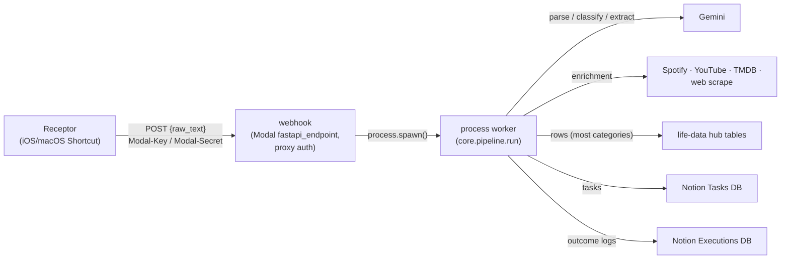

# Project Synapse 🧠

> An intelligent middleware for capturing thoughts and organizing them in life-data and Notion.

Synapse eliminates the friction of manual data entry. It accepts unstructured, natural-language text, uses a multi-step AI chain (parse → classify → extract) to understand and structure the content, and then routes it to the right life-data table (groceries, media, bookmarks, ideas, activities) or, for tasks, the Notion Tasks DB. The entire project is written in **Python** and deployed on **Modal**.

---

## Architecture

- **[Modal](https://modal.com)** hosts everything. `app.py` is the single deployment shim — image, secrets, endpoints. All business logic lives in `src/core/` as plain Python with **no Modal imports**.
- **`webhook`** — a proxy-authed `fastapi_endpoint`. Callers send `Modal-Key` + `Modal-Secret` headers; unauthorized requests are rejected at Modal's edge for free. It validates the payload and `spawn()`s the worker — **spawn IS the queue** (no Pub/Sub).
- **`process`** — the background worker (`timeout=600`, `memory=512`, `max_containers=1` to serialize runs since Notion dedupe is query-then-create, retries with backoff). Runs `core.pipeline.run`.
- **Gemini** (`gemini-3-flash-preview`, env-overridable via `GEMINI_MODEL`, with automatic fallback to `GEMINI_FALLBACK_MODEL` on a 404) does parsing, classification, and extraction with structured JSON output.
- **App secrets** are env vars only: the Modal secret `synapse` in the cloud, `op run` locally. `.env.tpl` is the canonical manifest (op:// refs, committed) — the app's own provider keys only.
- **Workspaces** hold everything that belongs to one user: their Notion ids, allowlists and wording, place tags, property-id map, and their Notion + life-data credentials. They live in the `synapse-state` Volume, edited with `just workspace ...`; each device token files its captures into one workspace. The repo carries only the generic template.


```mermaid
flowchart LR
    R["Receptor<br/>(iOS/macOS Shortcut)"] -->|"POST {raw_text}<br/>Modal-Key / Modal-Secret"| W["webhook<br/>(Modal fastapi_endpoint,<br/>proxy auth)"]
    W -->|"process.spawn()"| P["process worker<br/>(core.pipeline.run)"]
    P -->|"parse / classify / extract"| G["Gemini"]
    P -->|"enrichment"| X["Spotify · YouTube · TMDB ·<br/>web scrape"]
    P -->|"rows (most categories)"| H["life-data hub tables"]
    P -->|"tasks"| N["Notion Tasks DB"]
    P -->|"outcome logs"| L["Notion Executions DB"]
```

## Development

```bash
uv sync              # install everything
just test            # unit tests (no network)
just check           # ruff lint + format check
just dev             # live-reload deploy against real Modal infra (modal serve)
just test-integration  # real Gemini calls (key via 1Password)
just deploy          # test + sync-secrets + modal deploy
just recept "Buy eggs $ groceries"   # send one thought to the deployed webhook
```

Local runs against real services use 1Password injection — never plaintext on disk:

```bash
op run --env-file=.env.tpl -- uv run <cmd>
```

## Manual setup steps (cannot be codified)

Everything else is code; these are one-time console/dashboard actions:

1. **Modal auth (local):** `uv run modal token new`.
2. **Modal Proxy Auth Token:** Modal dashboard → Settings → Proxy Auth Tokens → mint a token. Give the token ID/secret to the Receptor client (and store them on a 1Password item of your choosing). The webhook rejects requests without `Modal-Key`/`Modal-Secret` headers.
3. **Google API key:** mint a **YouTube Data API v3 key** in the Google Cloud console (APIs & Services → Credentials) and put them on the 1Password item that `.env.tpl` references.
4. **CI secret:** `gh secret set OP_SERVICE_ACCOUNT_TOKEN` with a 1Password service-account token that can read the project's vault (the one `.env.tpl` references).
5. **Push secrets to Modal:** `just sync-secrets` (reads `.env.tpl`, injects via `op`, creates/updates the `synapse` Modal secret).
6. **Notion select options:** every `allowlist` value of a Notion-backed stanza (one with a `db_id`: `tasks`, `logs`) must exist as an option on the live Notion select/multi_select/status property (add missing ones in the Notion UI). Hydration intersects allowlists with live options and prints a `⚠️ ... allowlist options missing from Notion select` warning for any value it had to drop; the AI can never pick a dropped value. `hub_table` stanzas are checked by the life-data catalog instead: keep their allowlists in step with `life property list <table>`. Personal allowlists (the Fun Activities `Location` cities) go in the workspace overlay.
7. **Executions DB `Tags` property:** a `Tags` multi_select with the `project-append` option must exist on the Executions DB.

## Configuration: `src/core/template/databases.yaml` + a workspace overlay

The whole pipeline is YAML-driven. The template defines every category and its rules; a workspace's overlay supplies what is specific to it (`db_id` per Notion-backed category, the top-level `db_ids` for logs/projects, its own allowlists or wording, `tasks.place_tags`). `just workspace pull <id> <dir>` / `push <id> <dir>` round-trip an overlay.

To add a new Notion database category:

1. Add the category definition to `template/databases.yaml` (no ids), then add its `db_id` to each workspace's overlay and `just sync-prop-ids <id>`.

### Database level

| Field | Required | Usage |
| :--- | :--- | :--- |
| **`description`** | ✅ Yes | **The Classifier Prompt.** Used by the AI to decide if an incoming item belongs to this category. |
| **`helper`** | No | `true` marks a helper DB (`logs`, `youtube-channels`) that is only *related to*, never a classification target. |
| **`properties`** | ✅ Yes | Maps **exact Notion column names** to their rules. |

### Property level

- **`type`**: `title`, `rich_text`, `rich_text_list`, `url`, `date`, `select`, `multi_select`, `status`, `relation`, `boolean`.
- **`required`**: `true` forces the AI to produce a value.
- **`instruction`**: the extraction prompt for this field. Placeholders: `{current_date}` (Eastern time), `{raw_text}`. For `date` fields the instruction MUST demand ISO 8601 — `notion_utils._notion_date` raises on anything else.
- **`virtual`**: `true` hides the field from the AI; Python fills it.
- **`allowlist`**: strict enum for select/multi_select/status (for Notion-backed stanzas, intersected with live Notion options at runtime; see manual setup step 6).
- **`create_new`**: `true` lets the AI invent new values beyond the allowlist.

## Synapse Prompting Guide

- **Core Syntax**
  - **`@` splitter:** separate multiple distinct items in one message.
  - **`$` context:** define the Project, Date, Status, or category hint.
- **Defaults (if not specified)**
  - **Tasks:** Status `To Do` | Tag `Chore` | Priority `High` | Date `Today` (Eastern)
  - **Movies/TV/YouTube/Podcasts:** `Not Started` · **Fun Activities:** `Someday` · **Groceries:** `On List`
- **Category cheatsheet**
  - **Tasks (default):** `Update dating profile`
  - **Projects:** `Refactor code $ Synapse` (strict: must name the project in context, or carry `pj`; always a task linked to the project)
  - **URLs:** auto-route to **YouTube**, **Podcasts** (Spotify/TAL), or **Bookmarks**
  - **Dates/status:** `Cancel Uber One $ Jan 1` · `The Matrix $ movie priority`
- **Batch example:** `Renew passport @ https://youtu.be/xyz @ Buy eggs $ groceries`

## Repo layout

```
app.py            # the ONLY file that imports modal
src/core/         # business logic (pipeline, ai_engine, handlers, notion_utils, ...)
src/core/template/       # generic Notion schemas, extraction rules and prompts
src/core/workspace.py    # a user's overlay + credentials, the active workspace
store.py                 # durable key -> JSON store on the synapse-state Volume
tests/            # pytest suite (unit + test_integration.py for real Gemini)
scripts/          # one-off clients for the deployed webhook
.env.tpl          # secrets manifest (op:// refs)
```

## Deployment

Push to `main` → GitHub Actions runs `pytest -m "not integration"` and `modal deploy app.py` (Modal tokens loaded from 1Password). Manual: `just deploy`.

## Gemini credentials

Synapse uses a dedicated Google Cloud project and a dedicated API key restricted
to `generativelanguage.googleapis.com`. Enable that API, attach the project
to the intended billing account, and store the key as `GEMINI_API_KEY` in
this project's environment. Never copy an API key from another application.
Gemini request quotas are per project, so separate keys in one project do
not isolate quota ([Gemini rate limits](https://ai.google.dev/gemini-api/docs/rate-limits)).
Verify a small `generateContent` request with the configured model before
syncing a replacement key; listing models does not verify billing credits.

## Workflow capture and retained execution content

A workspace can select Life Data Tasks and Executions together through its
`workflow` mappings; absent mappings retain Notion behavior. Selected captures
require a canonical UUID `capture_id`, persisted by the caller across retries.
Authentication fixes the workspace. The server rejects a workspace mismatch or
reuse of a capture ID with changed input. Two separately submitted captures may
have identical text and still produce distinct output identities.

The operational journal freezes parser/extractor decisions, output mappings,
row IDs and bodies before delivery. Retry uses checked insert-only writes, so
completed, reviewed and tombstoned output rows remain unchanged. Logging failure
after a task write retains the task ID for recovery. Execution text is never
limited to Notion's 2,000-character property size on the Life Data path.

Execution bindings may specify `retained_fields` (logical mapped property names),
`max_inline_bytes` (default 131072 UTF-8 bytes), and a dedicated `files_prefix`.
Oversized selected text is retained through the hub file API using a
content-addressed key and `If-None-Match: *`. The complete original is frozen in
the journal before upload. Every upload, including an already-existing result,
is read back and checked byte-for-byte before a row can reference it. The row
contains a readable file link, byte count and SHA-256. Upload failure leaves the
output pending; a retry cannot silently replace the original or create a
reference to an unverified file. The workspace token needs read/write grants for
only its configured file prefix in addition to the required workflow tables.
