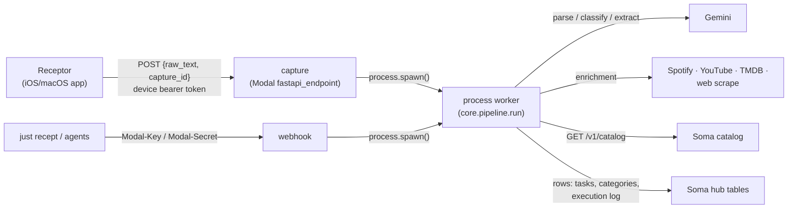

# Project Synapse 🧠

> An intelligent middleware for capturing thoughts and filing them as Soma rows.

Synapse eliminates the friction of manual data entry. It accepts unstructured, natural-language text, uses a multi-step AI chain (parse → classify → extract) to understand and structure the content, and then writes it to the right Soma table: tasks, groceries, media, bookmarks, ideas, things to do. Every capture also writes an execution log row. The entire project is written in **Python** and deployed on **Modal**.

---

## Architecture

- **[Modal](https://modal.com)** hosts everything. `app.py` is the single deployment shim — image, secrets, endpoints. All business logic lives in `src/core/` as plain Python with **no Modal imports**.
- **`webhook`** (operator, Modal proxy auth) and **`capture`** (Receptor, per-device bearer token) validate the payload and `spawn()` the worker — **spawn IS the queue** (no Pub/Sub).
- **`process`** — the background worker (`timeout=600`, `memory=512`, `max_containers=1`: one serialized worker owns the capture journals, and name/url dedupe is query-then-write; retries with backoff). Runs `core.pipeline.run`.
- **Gemini** (`gemini-3-flash-preview`, env-overridable via `GEMINI_MODEL`, with automatic fallback to `GEMINI_FALLBACK_MODEL` on a 404) does parsing, classification, and extraction with structured JSON output.
- **The Soma catalog is the contract.** Each column's type, required flag, select options and their meanings, defaults and enforced invariants come from the hub's `GET /v1/catalog` at run time (cached per workspace in the `synapse-state` Volume for an hour, revalidated by ETag, dropped when the hub rejects a write). Synapse carries no copy of the schema; `src/core/template/prompts.yaml` only says how to read text into it.
- **App secrets** are env vars only: the Modal secret `synapse` in the cloud, `op run` locally. `.env.tpl` is the canonical manifest (op:// refs, committed) — the app's own provider keys only.
- **Workspaces** hold everything that belongs to one user: their workflow table bindings, wording overrides, place tags and Soma hub credentials. They live in the `synapse-state` Volume, edited with `just workspace ...`; each device token files its captures into one workspace. The repo carries only the generic template.


```mermaid
flowchart LR
    R["Receptor<br/>(iOS/macOS app)"] -->|"POST {raw_text, capture_id}<br/>device bearer token"| C["capture<br/>(Modal fastapi_endpoint)"]
    O["just recept / agents"] -->|"Modal-Key / Modal-Secret"| W["webhook"]
    C -->|"process.spawn()"| P["process worker<br/>(core.pipeline.run)"]
    W -->|"process.spawn()"| P
    P -->|"parse / classify / extract"| G["Gemini"]
    P -->|"enrichment"| X["Spotify · YouTube · TMDB ·<br/>web scrape"]
    P -->|"GET /v1/catalog"| K["Soma catalog"]
    P -->|"rows: tasks, categories,<br/>execution log"| H["Soma hub tables"]
```

## Development

```bash
uv sync              # install everything
just test            # unit tests (no network)
just check           # ruff lint + format check
just dev             # live-reload deploy against real Modal infra (modal serve)
just test-integration  # real Gemini calls (key via 1Password)
just recept "Buy eggs $ groceries"   # send one thought to the deployed webhook
```

Local runs against real services use 1Password injection — never plaintext on disk:

```bash
op run --env-file=.env.tpl -- uv run <cmd>
```

## Manual setup steps (cannot be codified)

Everything else is code; these are one-time console/dashboard actions:

1. **Modal auth (local):** `uv run modal token new`.
2. **Modal Proxy Auth Token:** Modal dashboard → Settings → Proxy Auth Tokens → mint a token for the operator `webhook` (`just recept`). The webhook rejects requests without `Modal-Key`/`Modal-Secret` headers.
3. **Google API key:** mint a **YouTube Data API v3 key** in the Google Cloud console (APIs & Services → Credentials) and put it on the 1Password item that `.env.tpl` references.
4. **CI secret:** `gh secret set OP_SERVICE_ACCOUNT_TOKEN` with a 1Password service-account token that can read the project's vault (the one `.env.tpl` references).
5. **A workspace's Soma hub:** enroll a hub credential for the workspace (tables read/write on its tables, files read/write on its execution `files_prefix`) and store it with `just workspace set-secrets <id>`.

## Configuration: `src/core/template/prompts.yaml` + the catalog + a workspace overlay

`prompts.yaml` holds the prompt templates and one stanza per category. A stanza says where the category writes and how to read text into it; the catalog says what the column accepts. A workspace's overlay supplies its own `workflow` bindings and may reword anything (`just workspace pull <id> <dir>` / `push <id> <dir>` round-trip it).

### Category level

| Field | Usage |
| :--- | :--- |
| **`description`** | **The classifier prompt**: decides whether a capture belongs to this category. |
| **`table`** | The Soma table it writes (tasks take theirs from the workspace's `workflow.tasks` binding). |
| **`columns`** | Field name → catalog column for fields written on create. |
| **`capture_columns`** | Media fields the user may edit on an existing row (never forced, no default). |
| **`constants`**, **`match_on`**, **`review_if_missing`**, **`saved_column`** | Fixed columns, the natural key a repeat capture updates, unfillable fields that flag `needs_review`, the explicit-save flag. |
| **`properties`** | The fields the extractor fills, in prompt order. |

### Field level

- **`instruction`**: how to read this field from the text. Placeholders: `{current_date}` (Eastern time, or the workspace's task day), `{raw_text}`, `{place_tags}`.
- **`allowlist`**: narrows the catalog's options to the values Synapse may choose; the instruction then owns their meaning. A value the catalog lacks is dropped. On a field with no column (`Capture Intent`) it is the field's whole vocabulary.
- **`required`**: `true` makes the extractor always answer a field the catalog leaves optional.

Type, catalog `required`, options with their meanings and defaults come from the catalog; the store's enforced invariants are stated in the prompt.

## Synapse Prompting Guide

- **Core Syntax**
  - **`@` splitter:** separate multiple distinct items in one message.
  - **`$` context:** define the Project, Date, Status, or category hint.
- **Defaults (if not specified)**
  - **Tasks:** Status `To Do` | Tag `Chore` | Priority `High` | Date `Today` (the workspace's task day)
  - Every other default is the Soma catalog's: a new movie, show, video or podcast starts `Not Started`, an activity `Someday`, a grocery `On List`
- **Category cheatsheet**
  - **Tasks (default):** `Update dating profile`
  - **Projects:** `Refactor code $ Synapse` (strict: must name the project in context, or carry `pj`; always a task linked to the project)
  - **URLs:** auto-route to **YouTube**, **Podcasts** (Spotify/TAL), or **Bookmarks**
  - **Dates/status:** `Cancel Uber One $ Jan 1` · `The Matrix $ movie priority`
- **Batch example:** `Renew passport @ https://youtu.be/xyz @ Buy eggs $ groceries`

## Repo layout

```
app.py            # the ONLY file that imports modal
src/core/         # business logic (pipeline, ai_engine, handlers, workflow, ...)
src/core/template/prompts.yaml  # prompts + per-category table wiring and phrasing
src/core/catalog.py      # the Soma catalog slice prompts are built from
src/core/workspace.py    # a user's overlay + credentials, the active workspace
store.py                 # durable key -> JSON store on the synapse-state Volume
tests/            # pytest suite (unit + test_integration.py for real Gemini)
scripts/          # operator clients: workspaces, device tokens, the webhook
.env.tpl          # secrets manifest (op:// refs)
```

## Deployment

Push to `main` → GitHub Actions runs `pytest -m "not integration"`, syncs the app secrets and runs `modal deploy app.py` (Modal tokens loaded from 1Password).

## Gemini credentials

Synapse uses a dedicated Google Cloud project and a dedicated API key restricted
to `generativelanguage.googleapis.com`. Enable that API, attach the project
to the intended billing account, and store the key as `GEMINI_API_KEY` in
this project's environment. Never copy an API key from another application.
Gemini request quotas are per project, so separate keys in one project do
not isolate quota ([Gemini rate limits](https://ai.google.dev/gemini-api/docs/rate-limits)).
Verify a small `generateContent` request with the configured model before
syncing a replacement key; listing models does not verify billing credits.

## Workflow capture and retained execution content

A workspace binds its Soma tasks, executions and projects tables through its
`workflow` mappings; tasks and executions are required. Every capture carries
a canonical UUID `capture_id`, persisted by the caller across retries.
Authentication fixes the workspace. The server rejects a workspace mismatch or
reuse of a capture ID with changed input. Two separately submitted captures may
have identical text and still produce distinct output identities.

The operational journal freezes parser/extractor decisions, output mappings,
row IDs and bodies before delivery. Retry uses checked insert-only writes, so
completed, reviewed and tombstoned output rows remain unchanged. Logging failure
after a task write retains the task ID for recovery. Execution text is never
truncated.

Execution bindings may specify `retained_fields` (logical mapped property names),
`max_inline_bytes` (default 131072 UTF-8 bytes), and a dedicated `files_prefix`.
Oversized selected text is retained through the hub file API using a
content-addressed key and `If-None-Match: *`. The complete original is frozen in
the journal before upload. Every upload, including an already-existing result,
is read back and checked byte-for-byte before a row can reference it. The row
contains a readable file link, byte count and SHA-256. Upload failure leaves the
output pending; a retry cannot silently replace the original or create a
reference to an unverified file. The workspace token needs read/write grants for
only its configured file prefix in addition to the required workflow tables.
